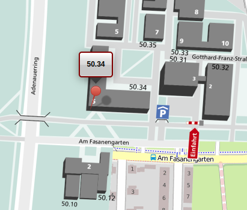

# Organisatorisches

Wichtige Links:

* [Ilias](https://s.kit.edu/gbi)
* [Discord](https://discord.gg/M6XdSkNd)
* [Archiv](http://gbi.ira.uka.de/)

Eine Aufzeichnung der Vorlesung sowie die Folien und das Skript sind auf [Ilias](s.kit.edu/gbi) verfügbar.

## Anforderungen
### Teilleistungen
Um das Modul zu bestehen muss sowohl der Übungsschein erhalten sowie die Klausur bestanden werden.
Diese beiden sind formal vollkommen unabhängig voneinander.

### Übungsschein
Für den Übungsschein sind mindestens 50% der Punkte in den Aufgabenblättern 1-6 **und**
50% der Punkte in den Aufgabenblättern 7-12 erforderlich.

### Klausur
Zum Bestehen der Klausur sind mindestens 50% der Punkte erforderlich.
Die Klausurnote ist gleichzeitig die Modulnote.

## Orientierungsprüfung
Das Modul "Grundbegriffe der Informatik" ist Teil der Orientierungsprüfung.
Die Prüfung ist bis zum Ende des zweiten Fachsemesters anzutreten und bis zum Ende des
dritten Fachsemesters zu bestehen.

## Tutorien
Die Tutorien beginnen am Montag, dem 25. Oktober.
Während den Tutorien werden die Übungsblätter korrigiert und der Stoff vertieft.

## Übungsblätter
Die Übungsblätter werden jeden Freitag um 12:30 auf [Ilias](s.kit.edu/gbi) hochgeladen.
Die Abgabe muss spätestens bis zum Freitag um 12:30 in der darauffolgenden Vorlesungswoche erfolgen.
Abgabeort sind die Briefkästen im 1. Untergeschoss von Geb. 50.34 (Informatikfakultät).
<figure markdown> 
  { width="300" }
  <figcaption>Gebäude 50.34</figcaption>
</figure>
